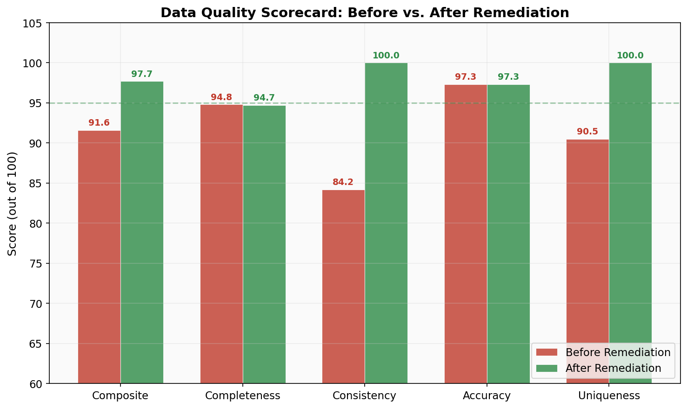
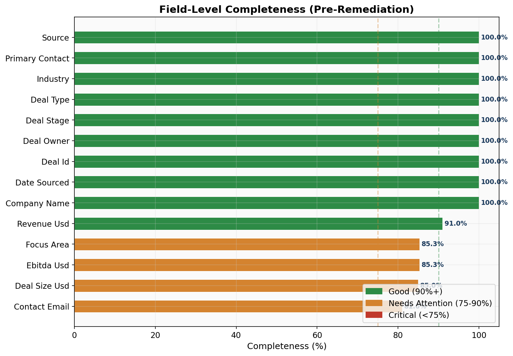
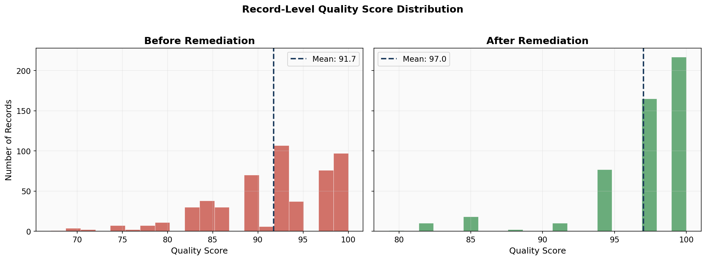
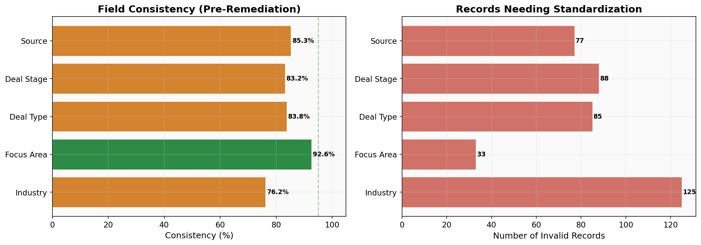

# CRM Data Quality Audit & Remediation (Python + R)

A complete data quality audit workflow for a simulated private equity CRM dataset. This project demonstrates profiling, scoring, remediation, and monitoring of deal pipeline data, from identifying issues to measuring improvement.

**All data is entirely synthetic.** No proprietary or confidential information is used.

---

## Business Context

Private equity firms manage hundreds of deal opportunities across a CRM, but data quality often degrades over time through inconsistent entry, missing fields, and duplicate records. Poor data quality leads to unreliable reporting, missed insights, and flawed pipeline analytics.

This project simulates a real-world scenario: inheriting a CRM with ~500 deal records containing quality issues, then systematically auditing, scoring, cleaning, and measuring improvement.

---

## Results Summary

| Metric | Before | After | Improvement |
|--------|--------|-------|-------------|
| **Composite Score** | 91.6 | 97.7 | +6.1 |
| Completeness | 94.8 | 94.7 | — |
| Consistency | 84.2 | 100.0 | +15.8 |
| Accuracy | 97.3 | 97.3 | — |
| Uniqueness | 90.5 | 100.0 | +9.5 |
| **Records** | 525 | 500 | 25 duplicates removed |

### Key Actions Taken
- **Standardized 5 categorical fields** (industry, focus area, deal type, stage, source), correcting ~408 inconsistent values
- **Removed 25 duplicate records** identified through normalized company name + date matching
- **Flagged 29 invalid emails**, 21 date anomalies, and 23 financial outliers for manual review

---

## Visualizations

### Before vs. After Scorecard


### Field-Level Completeness


### Record Score Distribution


### Consistency Breakdown


---

## Project Structure

```
project-1-crm-data-quality-audit/
├── README.md
├── data/
│   ├── crm_deals_raw.csv            # Synthetic dataset with quality issues (525 records)
│   └── crm_deals_cleaned.csv        # Remediated dataset (500 records)
├── scripts/
│   ├── generate_synthetic_data.py    # Dataset generation with intentional issues
│   ├── data_profiler.py              # Profiling & quality scoring engine
│   ├── remediate_data.py             # Standardization & cleaning rules
│   ├── generate_visualizations.py    # Publication-ready charts
│   └── quality_checks.sql           # SQL-based quality check queries
├── scripts_r/
│   ├── 01_data_profiler.R            # Profiling & quality scoring engine
│   ├── 02_remediate_data.R           # Standardization & cleaning rules
│   ├── 03_generate_visualizations.R  # Publication-ready charts
└── output/
    ├── profile_report_raw.json       # Pre-remediation profile
    ├── profile_report_cleaned.json   # Post-remediation profile
    ├── remediation_log.json          # Audit trail of all changes
    ├── deals_with_scores.csv         # Records with quality scores (before)
    ├── deals_cleaned_with_scores.csv # Records with quality scores (after)
    └── *.png                         # Visualization charts
```

---

## Quality Scoring Methodology

Each record receives a composite quality score (0-100) based on weighted dimensions:

| Dimension | Weight | What It Measures |
|-----------|--------|-----------------|
| **Completeness** | 40% | % of critical and important fields populated |
| **Consistency** | 30% | % of values matching standard reference lists |
| **Accuracy** | 30% | Logical validation (email format, date sequences, financial ranges) |

The aggregate scorecard adds **Uniqueness** (15%) as a dataset-level metric, with the other three reweighted to 30/30/25.

---

## Quality Issues Embedded in Synthetic Data

| Issue Type | Description | Count |
|-----------|-------------|-------|
| Missing values | Null/empty values in critical and important fields | ~15-25% per field |
| Inconsistent naming | Mixed case, abbreviations, alternate names for industries/stages | 15+ unique industry values (should be 3) |
| Duplicates | Same company + date with slight variations | 25 records |
| Invalid emails | Malformed addresses ("user at domain.com", "N/A") | ~30 records |
| Date anomalies | Future dates, review-before-sourced sequences | ~20 records |
| Financial outliers | Revenue >$200M, negative EBITDA | ~15 records |

---

## How to Run

```bash
# 1. Install dependencies
pip install pandas faker matplotlib seaborn numpy

# 2. Generate a synthetic dataset
python scripts/generate_synthetic_data.py

# 3. Profile the raw data
python scripts/data_profiler.py

# 4. Remediate and re-profile
python scripts/remediate_data.py

# 5. Generate visualizations
python scripts/generate_visualizations.py
```

---

## Skills Demonstrated

- **Data Profiling**: Systematic assessment of completeness, consistency, accuracy, and uniqueness
- **Data Quality Scoring**: Weighted composite scoring at both record and dataset level
- **Data Remediation**: Fuzzy matching, standardization mapping, duplicate resolution
- **SQL**: Quality check queries adaptable to any relational database
- **Python**: pandas, matplotlib, automated reporting pipelines
- **Data Governance**: Audit trail documentation, reference data management
- **Visualization**: Publication-ready charts communicating quality metrics to stakeholders

---

## Technologies

Python (pandas, numpy, faker, matplotlib) · R · SQL · Data Quality Frameworks

---

*Built as part of a portfolio demonstrating BI/Data Analyst capabilities. Inspired by real-world CRM data management in private equity, reconstructed entirely with synthetic data.*
